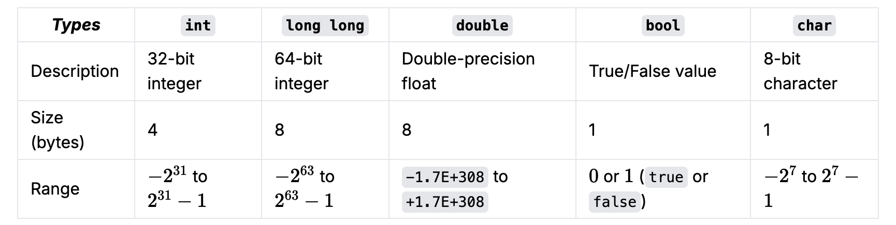

# Programming Basics with `C++`

## Hello World

```cpp
#include <iostream>;

using namespace std;

int main(){

    cout << "Hello World" << endl;
}
```

Ask from Gemini or ChatGPT to explain this code.

## 

Variables
Data types
Reading Input
Writing Output
Loops (for, while)
If / Else
Logical operators
Functions
Basic Recursion (a function calling itself)
Arrays
Multidimensional Arrays


More problem set

https://cses.fi/problemset/list/ 
https://open.kattis.com/ 

## C++: Common Fundamental Data Types

Note: These numbers may vary depending on your machine and/or compiler. 
For more fundamental data types, check the first resource in the table above.




## Style Guide

Competitive Coding Recommendations for C++ is also useful for learning & practicing DSA.
https://codeforces.com/blog/entry/64218

## Practice Questions:

This collection of practice problems focuses on the fundamental manipulation of linear and 2D data structures, specifically targeting common patterns in arrays, strings, and matrices.

The exercises range from basic element-wise operations and string transformations to more advanced logic involving two pointers, sliding windows, and coordinate mapping in grids. 

By solving these, you develop a strong intuition for time complexity optimization ($O(n)$ vs. $O(n^2)$) and learn to handle the various edge cases associated with indexing and in-place memory management.


1920. Build Array from Permutation
1470. Shuffle the Array
88. Merge Sorted Array
1. Two Sum
121. Best Time to Buy and Sell Stock
217. Contains Duplicate
1431. Kids With the Greatest Number of Candies
1295. Find Numbers with Even Number of Digits
1304. Find N Unique Integers Sum up to Zero 
1827. Minimum Operations to Make the Array Increasing 
 125. Valid Palindrome 
 1844. Replace All Digits with Characters 
 709. To Lower Case 
 1662. Check If Two String Arrays are Equivalent 
 771. Jewels and Stones 
 2114. Maximum Number of Words Found in Sentences 
 1528. Shuffle String 
 242. Valid Anagram 
 2500. Delete Greatest Value in Each Row 
 1572. Matrix Diagonal Sum
 1260. Shift 2D Grid 
 867. Transpose Matrix 
 766. Toeplitz Matrix 


You can find solutions [here](./practice/readme.md)