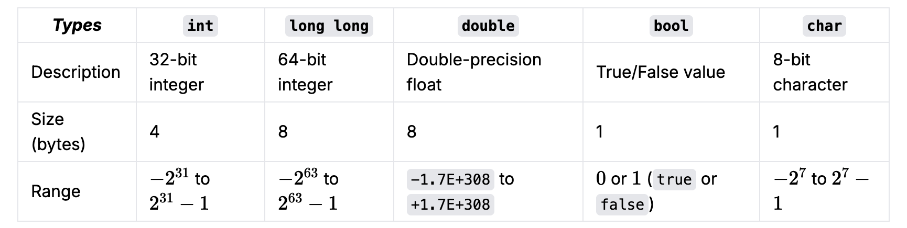

# Programming Basics with `C++`

## Hello World

```cpp
#include <iostream>;

using namespace std;

int main(){

    cout << "Hello World" << endl;
}
```

Ask from Gemini or ChatGPT to explain this code.

## 

Variables
Data types
Reading Input
Writing Output
Loops (for, while)
If / Else
Logical operators
Functions
Basic Recursion (a function calling itself)
Arrays
Multidimensional Arrays


More problem set

https://cses.fi/problemset/list/ 
https://open.kattis.com/ 

## C++: Common Fundamental Data Types

Note: These numbers may vary depending on your machine and/or compiler. 
For more fundamental data types, check the first resource in the table above.




## Style Guide

Competitive Coding Recommendations for C++ is also useful for learning & practicing DSA.
https://codeforces.com/blog/entry/64218

